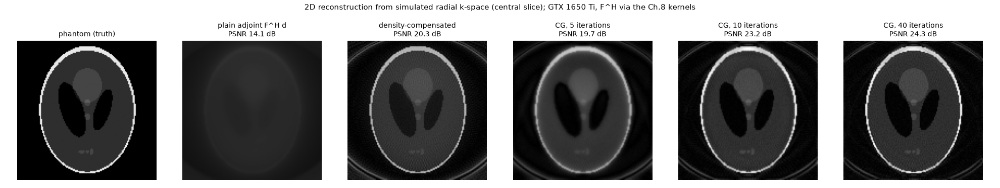

# Programming Massively Parallel Processors: hands-on CUDA reproductions

Runnable CUDA C++ reproductions of the techniques and case studies in
*Programming Massively Parallel Processors: A Hands-on Approach* (Kirk & Hwu). Each program isolates one idea from the
book, runs it on a real GPU, verifies the result against a double-precision CPU reference, measures it with warm-up and
averaged repeats, and states plainly when a claim made for the book's 2008-era G80 does or does not reproduce on a
modern (Turing) GPU.



*Central figure: a head phantom reconstructed from simulated non-Cartesian k-space with the book's F^H d kernels
(plain adjoint, density-compensated adjoint, conjugate gradient). Numbers: [04_case_studies/README.md](04_case_studies/README.md).*

## Repository map

| Folder | Book topic | What is in it |
| --- | --- | --- |
| [`01_architecture_basics`](01_architecture_basics/README.md) | GPU architecture (Ch. 1-4) | device query, block/warp scheduling, vector add with transfer timing |
| [`02_tiling_and_reduction`](02_tiling_and_reduction/README.md) | Memory and reduction (Ch. 5-6) | naive vs tiled matrix multiply, three sum-reduction kernels |
| [`03_resource_partitioning`](03_resource_partitioning/README.md) | Performance tuning (Ch. 6-7) | occupancy model, register / shared-memory cliffs, loop unrolling |
| [`04_case_studies`](04_case_studies/README.md) | Application case studies (Ch. 8-10) | MRI reconstruction, Coulomb summation, cutoff binning, constant-cache behaviour, GPU starvation; tests, figures, statistics |

The case-study chapters are numbered as in the edition used here: Chapter 8 is MRI, Chapter 9 is electrostatic
(Coulomb) potential, Chapter 10 is cutoff binning.

## What the case studies show (all numbers are [MEASURED] on the test GPU unless marked)

| Study | Result | Result file |
| --- | --- | --- |
| Direct Coulomb summation, 100^3 lattice x 100k atoms | 4 points/thread kernel is fastest: 99.9 G evals/s vs 70.0 (1 point/thread) and 63.9 (8 points/thread) | `04_case_studies/stats/01_dcs.csv` |
| MRI F^H d ladder, 262,144 voxels x 8,192 samples | naive 99.3 ms -> hardware sin/cos + constant memory 51.2 ms | `04_case_studies/stats/08a_mri_ladder.csv` |
| MRI F^H d, full 128^3 x 284,592 samples | 8.99 s, 66.4 G pairs/s | `04_case_studies/stats/08a_mri_ladder.csv` |
| Constant cache, 512-atom windows | data-cache hit rate 87.8 % when all blocks read the same window, 49.6 % when each reads its own | `04_case_studies/output/06_ncu_summary.txt` |
| Constant cache, 32 distinct addresses per warp | 64.0 ms vs 2.8 ms for one address per warp | `04_case_studies/output/06_ncu_summary.txt` |
| MRI tuning | joint block/chunk/unroll search is 8.7 % faster than tuning one knob at a time (book: about 20 %) | `04_case_studies/output/08c_mri_accuracy_tuning.txt` |
| GPU starvation, 256 MB streamed, 1024 FMAs per element | pinned + copy-ahead pipeline 75.3 ms wall vs 232.5 ms pageable synchronous copies | `04_case_studies/stats/09_summary.csv` |
| Launch overhead, 2000 tiny kernels | 115.9 ms (sync each) vs 41.1 ms (sync once) vs 0.375 ms (fused) | `04_case_studies/stats/09_summary.csv` |
| MRI reconstruction from radial k-space (2D, 40 CG iterations) | PSNR 14.1 dB (plain adjoint) -> 20.3 dB (density-compensated) -> 24.3 dB (CG) | `04_case_studies/stats/08e_recon_metrics.csv` |

Limits worth knowing: the 3D reconstruction (32^3) reaches only 17.9 dB and is too small to be convincing; the book's
27.6 dB figure comes from a different data set and is not reproduced by these synthetic scans; hardware `__sinf/__cosf`
made no visible PSNR difference at this size (book: 27.6 vs 27.5 dB).

## Requirements

- NVIDIA GPU with compute capability 7.5 (Turing). Other architectures: change `ARCH` in the Makefiles.
- CUDA Toolkit 12.x (`nvcc`), a C++14 host compiler (developed with CUDA 12.9 and gcc 11.5), GNU make.
- NVML (`libnvidia-ml`) for the GPU monitoring built into the case-study programs (ships with the driver).
- Python 3 with `numpy`, `pandas`, `matplotlib` only to regenerate figures.
- Optional: [Catch2 v3](https://github.com/catchorg/Catch2) (vcpkg: `vcpkg install catch2`) for `make catch2`; `ncu` with GPU
  performance counters enabled for `make profile`.

Developed on a GTX 1650 Ti (16 SMs, 4 GB) under WSL2. Windows enforces a GPU watchdog, so every kernel launch is kept to a few
milliseconds and long work is chunked.

## Build, run, test

```bash
cd 04_case_studies
make                 # build every program into bin/
make test            # 4 unit/invariant suites + check that every result file reports ALL VARIANTS PASS
make run             # regenerate output/<program>.txt (one file per program)
scripts/fetch_parboil_data.sh   # downloads the two Parboil MRI-Q inputs (size + sha256 verified); needed by 08d only
make figures         # regenerate figures/*.png from stats/*.csv
make catch2          # optional Catch2 toolchain check
```

The three earlier folders build the same way (`cd 01_architecture_basics && make run`).

## Method

- Every result is checked against a double-precision CPU reference (sampled on large problems); the error is scaled by the
  sum of absolute terms.
- Timings are warm (one or more warm-up launches) and averaged over repeats, with variants interleaved. The GPU's
  temperature is read through NVML and the run waits for it to cool, because thermal throttling changed some timings by
  up to 4x during development.
- Numbers are labelled `[MEASURED]`, `[DERIVED]` (computed from measurements) or `[book]` (quoted). A cause is stated only
  if a test supports it; otherwise the text says "hypothesis".
- Programs write their statistics to `stats/*.csv`; small Python scripts turn those into figures.

## Not included

- Multi-GPU execution (Section 9.6 of the book): needs more than one GPU and is not implemented.
- The Parboil data files are not redistributed (licence not verified); the fetch script downloads them and checks size and
  SHA-256.

## References

- David B. Kirk and Wen-mei W. Hwu, *Programming Massively Parallel Processors: A Hands-on Approach*, Morgan Kaufmann
  (Elsevier), 2010.
- Parboil benchmark suite (MRI-Q input data), University of Illinois IMPACT group.

## License

MIT, see [LICENSE](LICENSE). The book's text and figures are not reproduced here.
